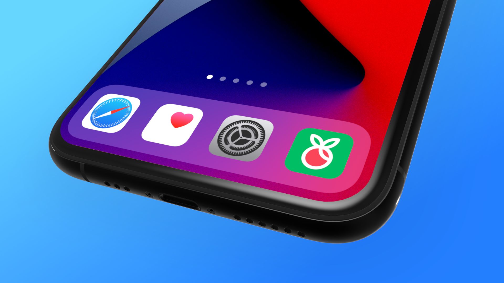
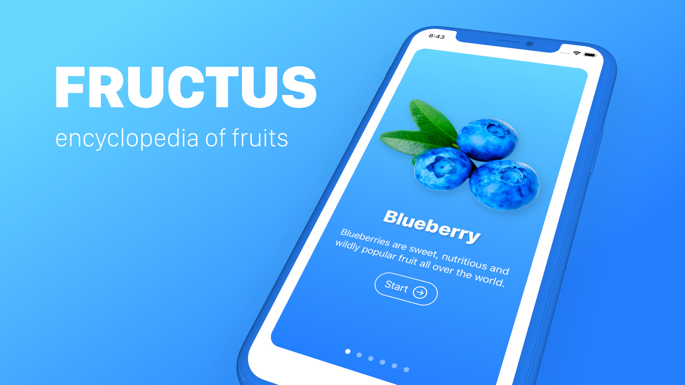
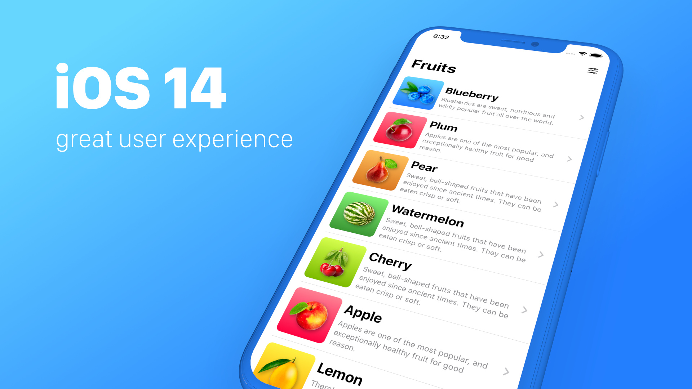
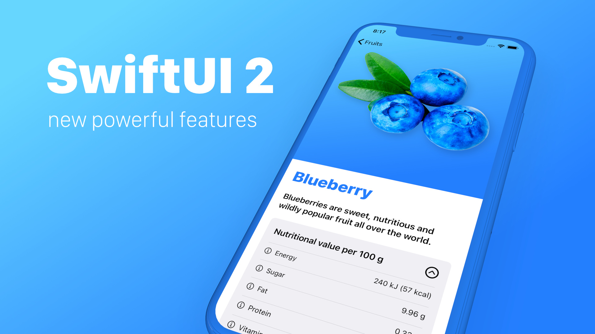
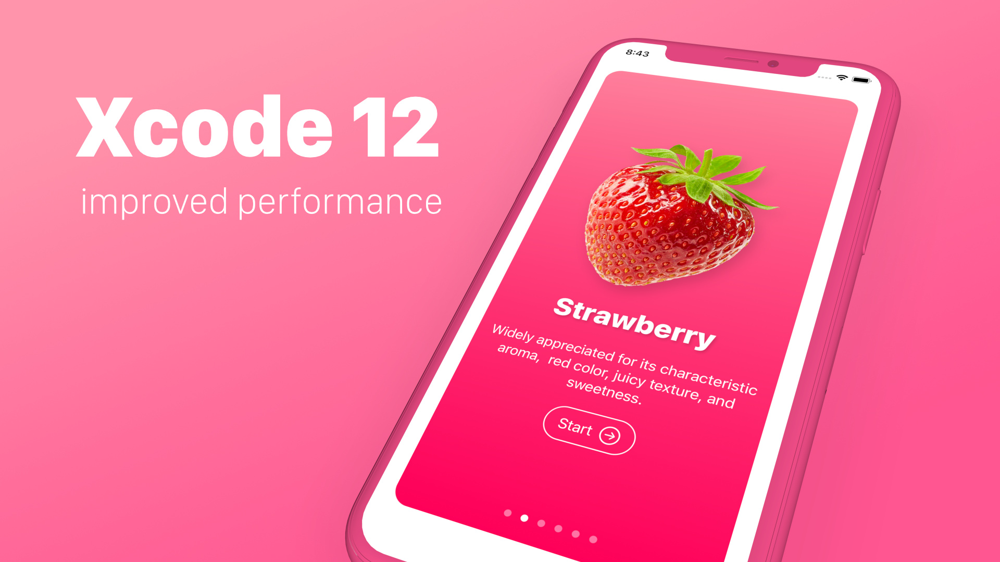
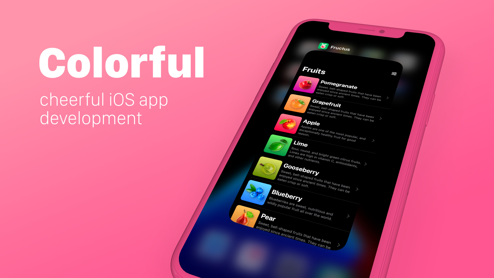
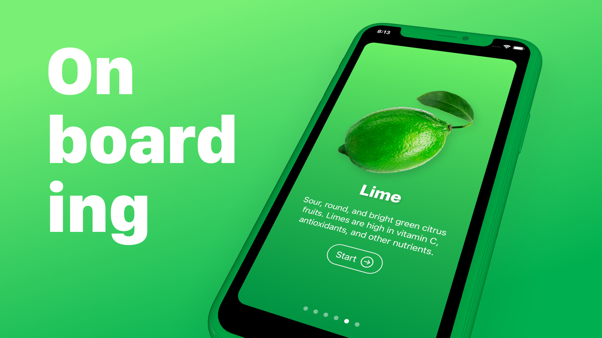
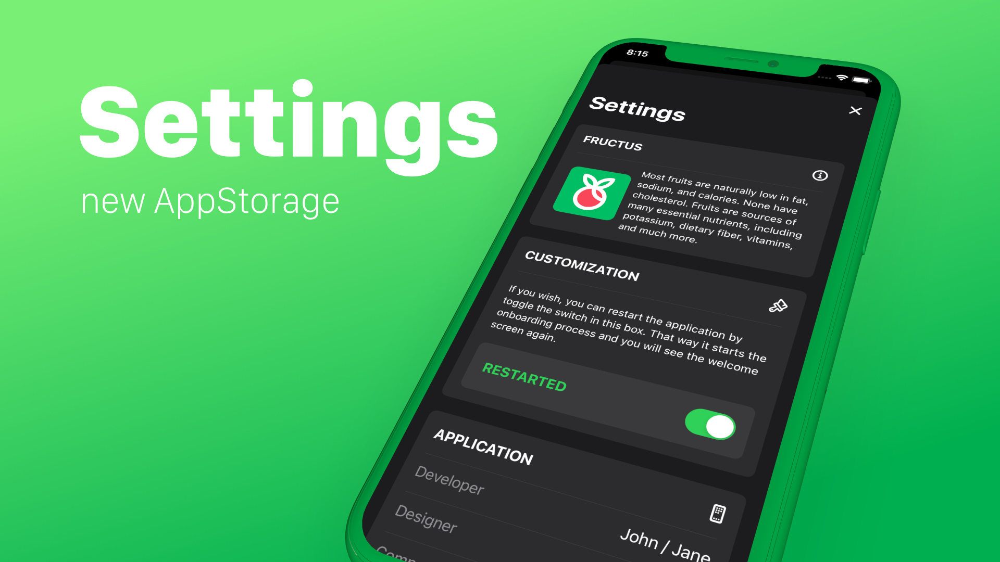
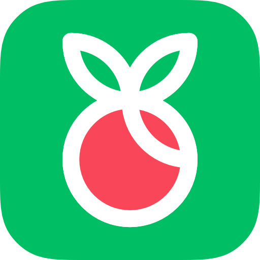

# FRUCTUS

## Main objectives of this iOS SwiftUI project

SwiftUI offers new features, improved performance, and the power to do, even more, all while maintaining a stable API that makes it easy to bring your existing SwiftUI code forward into Xcode 12.
iOS 14 mobile application

### iOS 14

This playful project will be a great start to get learning the latest and greatest of the upcoming release of the operating system.

Since iOS 14 brings a fresh look to the things you do most often, therefore making iOS, iPadOS, macOS, watchOS applications are easier than ever.
SwiftUI 2.0 with new features

### SWIFTUI 2.0

SwiftUI 2.0 is shipped with a brand new life cycle management API for apps built with SwiftUI let us write our entire app in SwiftUI and share even more code across all Apple platforms. It's providing faster performance, better diagnostics, and access to new controls.
Xcode 12

### XCODE 12

With an all-new design that looks fresh and modern on macOS 11 Big Sur, Xcode 12 has many great improvements such as:

    Streamlined and much faster code completion,

    Customizable font sizes for the navigator,

    New document tabs

    Universal apps by default to support Mac with Apple Silicon, etc.

Outstanding application

### LEARNING OBJECTIVES

What will you learn and what are the main objectives of this SwiftUI 2.0 project?

- How to set up a new iOS 14 project with the new SwiftUI App Life Cycle.

- How to develop a unique Onboarding screen

- How to use the new AppStorage in SwiftUI 2.0

- How to save and load data using UserDefaults

- How to create custom Views with SwiftUI

- How to retrieve local data using Structs in Swift 5.3

- How to display multiple Views automatically with ForEach loop

- How to use scroll view, horizontal view, vertical view containers

- How to create an outstanding Settings view

- How to add Icons to the App

- How to use the improved Canvas and Previews in Xcode 12

- How to test the iOS 14 app in Xcode Simulator

- Get familiar with the new Xcode 12

Onboarding screen wit Page Tab View

### ONBOARDING

One of the main learning objectives is to create a fully-featured iOS Onboarding screen with the new Page Tab View capability provided by the updated SwiftUI 2.0.

Users if they want, now they can restart the application by toggle the switch in the Settings screen. That way the app starts the onboarding process and we will see the welcome screen again.
Settings with reseting the app

### SETTINGS

Every outstanding app needs to have a well designed and thoughtful structure. This iOS 14 application is no exception from that.

You will get familiar with many new SwiftUi 2.0 views and features building this Onboarding screen.
App icon

### APP ICON AND IMAGE ASSETS

As you can know by now, this course provides you excellent image assets with high-quality custom app icons as always. This will give you a real-life experience of how an app developer works with a professional app designer together. I'm sure that you will enjoy the process and you will be glad by looking at the finished application.
